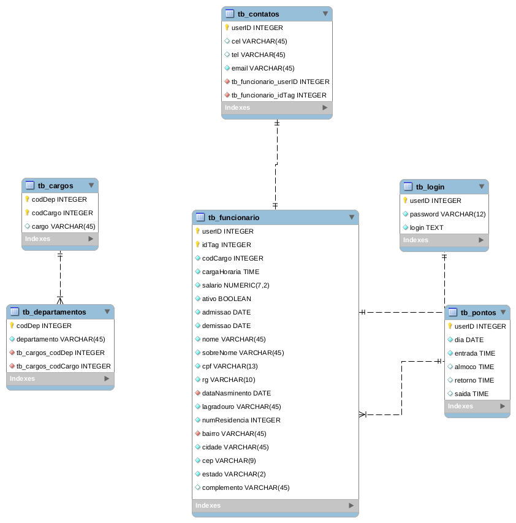
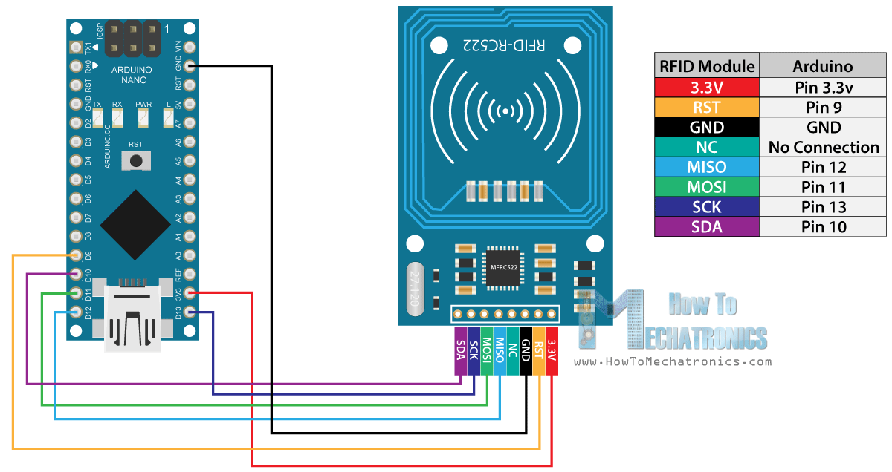

Banco de horas com RC522_RFID, arduino e website
==============

A ideia deste projeto é fazer um controle de banco de horas como o de uma empresa.

1a Realizamos um cadastro de um funcionário via website que por sua vez se conecta no banco de dados Postegres e grava as informações.
Apos cadastro realizado o funcionário pode registrar seus pontos pelo sensor RFID que controlado por um arduino nano envia os dados por um programa Python que por sua vez grava os dados no Postegres.

A página website também fornece uma visualização dos pontos mensais de um determindo funcionário.

## Diagrama DER 

  

## Linguagem Utilizadas:

* PHP 7.2
* JAVASCRIPT
* HTML 5
* CSS 3
* Python 3

## Esquemático do Projeto

  

## Pinagem Leitor RFID:

O leitor RFID tem 8 pinos que seguem a seguinte sequência de ligação. À tensão de alimentação, que neste caso é de 3.3 volts

* Pino SDA ligado na porta 10 do Arduino
* Pino SCK ligado na porta 13 do Arduino
* Pino MOSI ligado na porta 11 do Arduino
* Pino MISO ligado na porta 12 do Arduino
* Pino NC – Não conectado
* Pino GND  ligado no pino GND do Arduino
* Pino RST ligado na porta 9 do Arduino
* Pino 3.3 – ligado ao pino 3.3 V do Arduino

